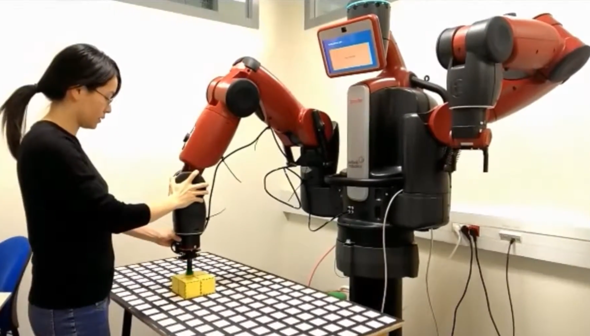

Hi, I am Sheryl and I specialise in human- centric AI and intuitive robotic systems. I develop generalisable solutions for robots to operate and adapt to real-world environments (end-user robot programming, robot architectures, belief management to control cognitive behaviour, etc.). My goal is to make complex robotic systems accessible to non-technical users and ultimately improve their quality of life. 
My interests include, but are not limited to: End-user Robotics, Cognitive Robotics, Learning from Demonstration, Human-Robot Interaction.

I created [iRoPro](https://github.com/ysl208/iRoPro), a full-stack, end-user robot programming framework allowing non-experts to easily teach robots customized tasks. Check out [this video](https://www.youtube.com/watch?v=YCDrC0UFX38) for a demonstration of the system.

Check out my work here:
[CV](Liang_CV.pdf) - [GoogleScholar](https://scholar.google.fr/citations?user=P0RMyasAAAAJ&hl) - [GitHub](https://github.com/ysl208) - [Youtube](https://www.youtube.com/channel/UCyzWw7khDDUz-McZfZXoz4Q)

You can contact me on [LinkedIn](https://linkedin.com/in/ysliang)  or via Email: sheryl [AT] liang [DOT] at

In my freetime, I enjoy making robot videos: [Baxter dances Macarena](https://www.youtube.com/watch?v=XBBXTNLUGbg)

